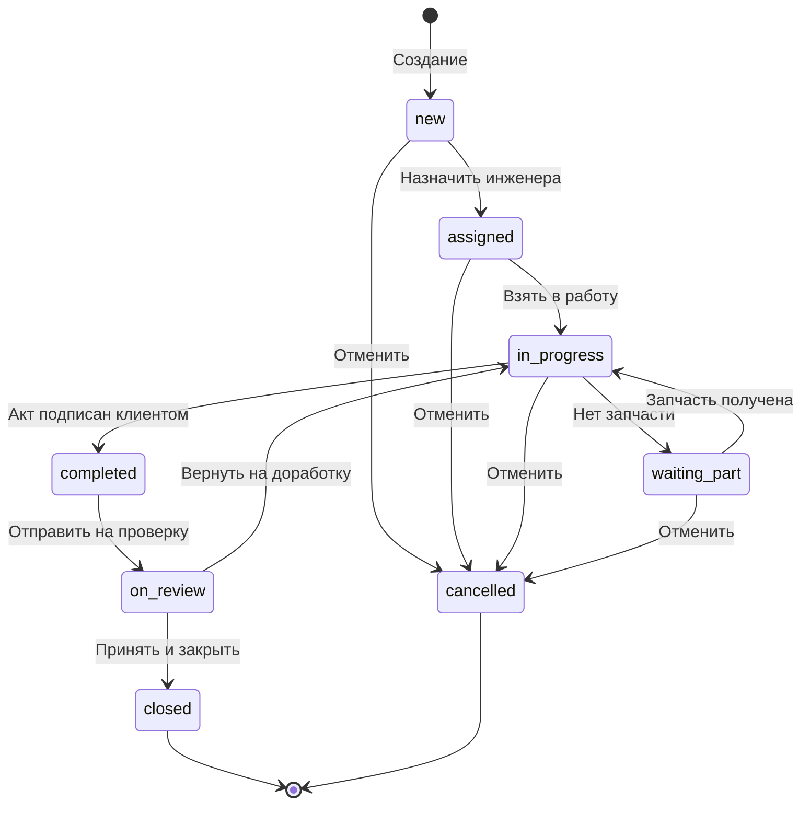
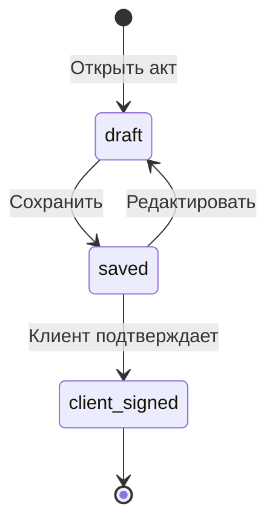
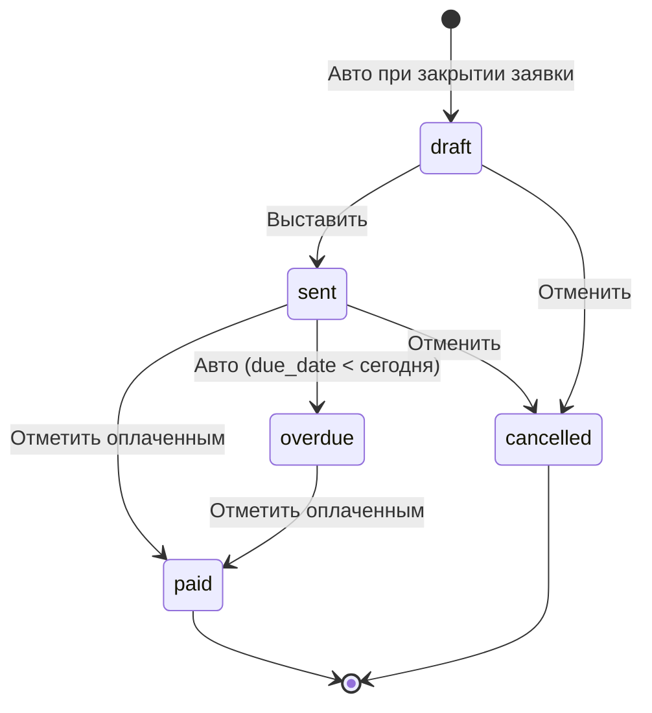
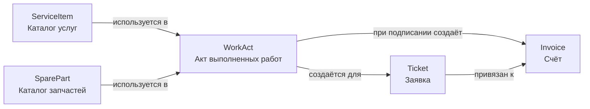

# Спецификация бизнес-документов — ServiceDesk CRM

**Версия:** 1.0 | **Дата:** 2026-04-06 | **Статус:** Рабочий

---

## Содержание

1. [Заявка на обслуживание (Ticket)](#1-заявка-на-обслуживание-ticket)
2. [Акт выполненных работ (WorkAct)](#2-акт-выполненных-работ-workact)
3. [Счёт (Invoice)](#3-счёт-invoice)
4. [Позиция каталога услуг (ServiceItem)](#4-позиция-каталога-услуг-serviceitem)
5. [Позиция каталога запчастей (SparePart)](#5-позиция-каталога-запчастей-sparepart)

---

## Роли пользователей (справочник)

| Код | Название |
|-----|---------|
| admin | Администратор |
| svc_mgr | Руководитель сервиса |
| engineer | Сервисный инженер |
| manager | Менеджер |
| client_user | Пользователь клиента |

---

## 1. Заявка на обслуживание (Ticket)

### 1.1 Реквизиты

| # | Название | EN name | Тип | Обяз. | Умолч. | Способ заполнения | Подсказка на экране |
|---|----------|---------|-----|-------|--------|-------------------|---------------------|
| 1 | Номер заявки | number | string(32) | Да | Авто: СД-YYYYMMDD-NNN | Авто | Уникальный номер заявки, присваивается автоматически |
| 2 | Клиент | client_id | FK → clients | Да | — | Выбор из справочника | Выберите организацию-клиента |
| 3 | Оборудование | equipment_id | FK → equipment | Нет | — | Выбор из справочника (фильтр по клиенту) | Выберите единицу оборудования клиента (необязательно) |
| 4 | Тема | title | string(255) | Да | — | Ручной ввод | Кратко опишите суть обращения |
| 5 | Описание | description | text | Нет | — | Ручной ввод | Подробное описание проблемы или задачи |
| 6 | Тип заявки | type | enum | Да | repair | Выбор из списка значений | Выберите тип: Ремонт / Техобслуживание / Диагностика / Монтаж |
| 7 | Приоритет | priority | enum | Да | medium | Выбор из списка значений | Низкий / Средний / Высокий / Критический |
| 8 | Статус | status | enum | Да | new | Авто (переходы) | Текущий статус заявки |
| 9 | Назначен инженер | assigned_to | FK → users(engineer) | Нет | — | Выбор из справочника | Выберите инженера для выполнения работ |
| 10 | Создал | created_by | FK → users | Да | Текущий пользователь | Авто | — |
| 11 | Шаблон работ | work_template_id | FK → work_templates | Нет | — | Выбор из справочника (фильтр по модели оборудования) | Применить шаблон типовых работ |
| 12 | Дедлайн SLA | sla_deadline | datetime | Нет | — | Авто (по типу и приоритету) | Плановый срок устранения по SLA |
| 13 | Дата закрытия | closed_at | datetime | Нет | — | Авто | Заполняется автоматически при переводе в статус «Закрыта» |
| 14 | Дата создания | created_at | datetime | Да | Авто | Авто | — |
| 15 | Дата изменения | updated_at | datetime | Да | Авто | Авто | — |
| 16 | Удалена | is_deleted | boolean | Да | false | Авто (soft delete) | — |

**Значения перечислений:**

| Поле | Значения |
|------|---------|
| type | `repair` — Ремонт, `maintenance` — Техобслуживание, `diagnostics` — Диагностика, `installation` — Монтаж |
| priority | `low` — Низкий, `medium` — Средний, `high` — Высокий, `critical` — Критический |
| status | `new` — Новая, `assigned` — Назначена, `in_progress` — В работе, `waiting_part` — Ожидание запчасти, `completed` — Выполнена, `on_review` — На проверке, `closed` — Закрыта, `cancelled` — Отменена |

---

### 1.2 Состояния

| Код | Название | Описание |
|-----|---------|---------|
| new | Новая | Заявка создана, инженер не назначен |
| assigned | Назначена | Инженер назначен, работы не начаты |
| in_progress | В работе | Инженер выполняет работы |
| waiting_part | Ожидание запчасти | Работы приостановлены — нет нужной запчасти |
| completed | Выполнена | Работы выполнены, акт подписан клиентом |
| on_review | На проверке | Руководитель сервиса проверяет результат |
| closed | Закрыта | Заявка закрыта, счёт выставлен |
| cancelled | Отменена | Заявка отменена |

---

### 1.3 Переходы между состояниями

| Переход | Из статуса | В статус | Условия |
|---------|-----------|---------|---------|
| Назначить инженера | new | assigned | Поле `assigned_to` заполнено |
| Взять в работу | assigned | in_progress | — |
| Нет запчасти | in_progress | waiting_part | — |
| Запчасть получена | waiting_part | in_progress | — |
| Акт подписан | in_progress | completed | WorkAct существует И `client_confirmed = true` |
| На проверку | completed | on_review | — |
| Принять и закрыть | on_review | closed | WorkAct сохранён |
| Вернуть на доработку | on_review | in_progress | Комментарий обязателен |
| Отменить | new / assigned / in_progress / waiting_part | cancelled | Причина отмены обязательна |

---

### 1.4 Реквизиты по состояниям

| Реквизит | new | assigned | in_progress | waiting_part | completed | on_review | closed | cancelled |
|----------|-----|---------|------------|-------------|----------|---------|--------|----------|
| Номер | R | R | R | R | R | R | R | R |
| Клиент | R/W | R | R | R | R | R | R | R |
| Оборудование | R/W | R/W | R | R | R | R | R | R |
| Тема | R/W | R/W | R | R | R | R | R | R |
| Описание | R/W | R/W | R/W | R | R | R | R | R |
| Тип заявки | R/W | R/W | R | R | R | R | R | R |
| Приоритет | R/W | R/W | R/W | R/W | R | R | R | R |
| Назначен инженер | — | R/W | R | R | R | R | R | R |
| Шаблон работ | R/W | R/W | — | — | — | — | — | — |
| Дедлайн SLA | R | R | R | R | R | R | R | R |
| Дата закрытия | — | — | — | — | — | — | R | — |

*R = только чтение, R/W = чтение и запись, — = не отображается*

---

### 1.5 Доступ по ролям

| Действие | admin | svc_mgr | engineer | manager | client_user |
|---------|-------|---------|---------|---------|------------|
| Создать заявку | ✅ | ✅ | ✅ | ✅ | ✅ (только свой клиент) |
| Просмотр списка | ✅ | ✅ | ✅ (назначенные) | ✅ | ✅ (только свой клиент) |
| Просмотр карточки | ✅ | ✅ | ✅ (назначенные) | ✅ | ✅ (только свой клиент) |
| Редактировать | ✅ | ✅ | ✅ (только описание) | ✅ | ❌ |
| Мягкое удаление | ✅ | ✅ | ❌ | ❌ | ❌ |

---

### 1.6 Переходы по ролям

| Переход | admin | svc_mgr | engineer | manager | client_user |
|---------|-------|---------|---------|---------|------------|
| new → assigned | ✅ | ✅ | ❌ | ❌ | ❌ |
| assigned → in_progress | ✅ | ✅ | ✅ | ❌ | ❌ |
| in_progress → waiting_part | ✅ | ✅ | ✅ | ❌ | ❌ |
| waiting_part → in_progress | ✅ | ✅ | ✅ | ❌ | ❌ |
| in_progress → completed | ✅ | ✅ | ✅ | ❌ | ❌ |
| completed → on_review | ✅ | ✅ | ❌ | ❌ | ❌ |
| on_review → closed | ✅ | ✅ | ❌ | ❌ | ❌ |
| on_review → in_progress | ✅ | ✅ | ❌ | ❌ | ❌ |
| * → cancelled | ✅ | ✅ | ❌ | ❌ | ❌ |

---

### 1.7 Проверки при переходах

| Переход | Проверка | Сообщение при ошибке |
|---------|---------|---------------------|
| new → assigned | `assigned_to` не пустой | «Укажите инженера для назначения заявки» |
| in_progress → completed | WorkAct существует для заявки | «Заполните акт выполненных работ» |
| in_progress → completed | `work_act.client_confirmed = true` | «Для завершения необходимо подтверждение клиента в акте» |
| on_review → closed | WorkAct существует | «Акт выполненных работ обязателен для закрытия» |
| on_review → in_progress | Комментарий к переходу не пустой | «Укажите причину возврата заявки на доработку» |
| * → cancelled | Поле `cancellation_reason` не пустое | «Укажите причину отмены заявки» |
| on_review → closed | (авто) Создать Invoice на основе WorkAct | — |

---

---

## 2. Акт выполненных работ (WorkAct)

### 2.1 Реквизиты

| # | Название | EN name | Тип | Обяз. | Умолч. | Способ заполнения | Подсказка на экране |
|---|----------|---------|-----|-------|--------|-------------------|---------------------|
| 1 | ID | id | integer | Да | Авто | Авто | — |
| 2 | Заявка | ticket_id | FK → tickets | Да | Из контекста | Авто | — |
| 3 | Инженер | engineer_id | FK → users | Да | Текущий пользователь | Авто | — |
| 4 | Дата работ | work_date | date | Да | Сегодня | Ручной ввод (datepicker) | Дата фактического выполнения работ. Нельзя указать будущую дату |
| 5 | Описание работ | work_description | text | Да | — | Ручной ввод | Опишите выполненные работы |
| 6 | Время в пути (мин) | travel_time_minutes | integer | Нет | 0 | Ручной ввод | Время в пути до объекта в минутах |
| 7 | Время работы (мин) | work_time_minutes | integer | Нет | 0 | Ручной ввод | Фактическое время выполнения работ в минутах |
| 8 | Услуги | services_used | JSON ([]service_line) | Нет | [] | Выбор из справочника ServiceItem | Добавьте выполненные работы/услуги из каталога |
| 9 | Запчасти | parts_used | JSON ([]part_line) | Нет | [] | Выбор из справочника SparePart | Добавьте использованные запчасти |
| 10 | Фотографии | photos | file[] | Да (мин. 1) | — | Загрузка файлов (JPEG/PNG, ≤10 МБ) | Прикрепите минимум 1 фото (до или после ремонта) |
| 11 | Подтверждение клиента | client_confirmed | boolean | Да | false | Авто при подписании | — |
| 12 | ФИО представителя | client_confirmed_by_name | string(255) | Да | — | Ручной ввод | Введите ФИО представителя клиента, подтвердившего работы |
| 13 | Способ подтверждения | client_confirmed_method | enum | Да | — | Выбор из списка значений | На устройстве / Ссылка на email / Устно |
| 14 | Дата подтверждения | client_confirmed_at | datetime | Нет | Авто | Авто | — |
| 15 | Статус акта | status | enum | Да | draft | Авто (переходы) | — |
| 16 | Дата создания | created_at | datetime | Да | Авто | Авто | — |

**Структура строки услуги (service_line):**

| Поле | Тип | Описание |
|------|-----|---------|
| service_item_id | FK → service_items | Позиция каталога услуг |
| name | string | Копия названия на момент создания |
| price_type | enum (fixed/hourly) | Тип цены |
| unit_price | decimal | Цена за единицу/час |
| qty | decimal | Количество (шт. или часов) |
| amount | decimal | Сумма (unit_price × qty) |

**Структура строки запчасти (part_line):**

| Поле | Тип | Описание |
|------|-----|---------|
| spare_part_id | FK → spare_parts | Позиция каталога запчастей |
| name | string | Копия названия на момент создания |
| sku | string | Артикул |
| is_client_part | boolean | true = запчасть клиента, цена = 0 |
| source | enum | `central` — центральный склад, `engineer` — склад инженера, `client` — запчасть клиента |
| unit_price | decimal | Цена (0 если is_client_part = true) |
| qty | integer | Количество |
| amount | decimal | Сумма (0 если is_client_part = true) |

**Значения перечислений:**

| Поле | Значения |
|------|---------|
| client_confirmed_method | `on_device` — На устройстве, `email_link` — Ссылка на email, `verbal` — Устно + ФИО |
| status | `draft` — Черновик, `saved` — Сохранён, `client_signed` — Подписан клиентом |
| source (part_line) | `central` — Центральный склад, `engineer` — Склад инженера, `client` — Запчасть клиента |

---

### 2.2 Состояния

| Код | Название | Описание |
|-----|---------|---------|
| draft | Черновик | Акт заполняется, ещё не сохранён |
| saved | Сохранён | Акт сохранён, ожидает подтверждения клиента |
| client_signed | Подписан клиентом | Клиент подтвердил выполненные работы. Триггер для Invoice |

---

### 2.3 Переходы между состояниями

| Переход | Из | В | Условия |
|---------|---|---|---------|
| Сохранить | draft | saved | work_description заполнен, мин. 1 фото |
| Редактировать | saved | draft | Клиент ещё не подтвердил |
| Подписан клиентом | saved | client_signed | client_confirmed_by_name заполнен, client_confirmed_method выбран |

---

### 2.4 Реквизиты по состояниям

| Реквизит | draft | saved | client_signed |
|----------|-------|-------|--------------|
| Дата работ | R/W | R | R |
| Описание работ | R/W | R | R |
| Время в пути | R/W | R | R |
| Время работы | R/W | R | R |
| Услуги | R/W | R | R |
| Запчасти | R/W | R | R |
| Фотографии | R/W | R | R |
| ФИО представителя | R/W | R/W | R |
| Способ подтверждения | R/W | R/W | R |
| Подтверждение клиента | — | R/W | R |

---

### 2.5 Доступ по ролям

| Действие | admin | svc_mgr | engineer | manager | client_user |
|---------|-------|---------|---------|---------|------------|
| Создать акт | ✅ | ✅ | ✅ (только своя заявка) | ❌ | ❌ |
| Просмотр | ✅ | ✅ | ✅ (только своя заявка) | ✅ | ✅ (только свой клиент) |
| Редактировать | ✅ | ✅ | ✅ (только своя, статус draft/saved) | ❌ | ❌ |

---

### 2.6 Переходы по ролям

| Переход | admin | svc_mgr | engineer | manager | client_user |
|---------|-------|---------|---------|---------|------------|
| draft → saved | ✅ | ✅ | ✅ | ❌ | ❌ |
| saved → draft | ✅ | ✅ | ✅ | ❌ | ❌ |
| saved → client_signed | ✅ | ✅ | ✅ | ❌ | ❌ |

---

### 2.7 Проверки при переходах

| Переход | Проверка | Сообщение при ошибке |
|---------|---------|---------------------|
| draft → saved | `work_description` не пустой | «Заполните описание выполненных работ» |
| draft → saved | Минимум 1 фото | «Прикрепите минимум 1 фотографию (до или после ремонта)» |
| draft → saved | Для каждой запчасти: если `is_client_part = false` — проверить остаток на складе ≥ qty | «На складе недостаточно: [Название запчасти] — запрошено [N], доступно [M]» |
| saved → client_signed | `client_confirmed_by_name` не пустой | «Укажите ФИО представителя клиента» |
| saved → client_signed | `client_confirmed_method` выбран | «Выберите способ подтверждения» |
| saved → client_signed | (авто) Списать запчасти с соответствующих складов (source: central / engineer) | — |
| saved → client_signed | (авто) Перевести заявку: если `in_progress` → `completed` | — |
| saved → client_signed | (авто) Создать Invoice в статусе `draft` по данным акта | — |

---

---

## 3. Счёт (Invoice)

### 3.1 Реквизиты

| # | Название | EN name | Тип | Обяз. | Умолч. | Способ заполнения | Подсказка на экране |
|---|----------|---------|-----|-------|--------|-------------------|---------------------|
| 1 | Номер счёта | number | string(32) | Да | Авто: СЧ-YYYY-NNN | Авто | — |
| 2 | Клиент | client_id | FK → clients | Да | Из заявки | Авто | — |
| 3 | Заявка | ticket_id | FK → tickets | Нет | Из контекста | Авто | — |
| 4 | Тип счёта | type | enum | Да | mixed | Авто (по составу позиций) | Услуги / Запчасти / Смешанный |
| 5 | Статус | status | enum | Да | draft | Авто (переходы) | — |
| 6 | Дата выставления | issue_date | date | Да | Сегодня | Авто | — |
| 7 | Срок оплаты | due_date | date | Нет | +14 дней | Ручной ввод | Дата, до которой должна быть произведена оплата |
| 8 | Позиции счёта | items | []InvoiceItem | Да | Из акта | Авто + ручное добавление | — |
| 9 | Сумма без НДС | subtotal | decimal(14,2) | Да | Авто | Вычисляемое | — |
| 10 | Ставка НДС (%) | vat_rate | decimal(5,2) | Да | 20.00 | Ручной ввод | Ставка НДС в процентах |
| 11 | Сумма НДС | vat_amount | decimal(14,2) | Да | Авто | Вычисляемое (subtotal × vat_rate / 100) | — |
| 12 | Итого | total_amount | decimal(14,2) | Да | Авто | Вычисляемое (subtotal + vat_amount) | — |
| 13 | Примечание | notes | text | Нет | — | Ручной ввод | Дополнительные комментарии к счёту |
| 14 | Создал | created_by | FK → users | Да | Авто | Авто | — |
| 15 | Дата оплаты | paid_at | datetime | Нет | — | Авто при смене статуса на «Оплачен» | — |
| 16 | Дата создания | created_at | datetime | Да | Авто | Авто | — |

**Структура позиции счёта (InvoiceItem):**

| Поле | Тип | Описание |
|------|-----|---------|
| id | integer | PK |
| invoice_id | FK → invoices | Принадлежность счёту |
| item_type | enum (`service` / `part`) | Тип позиции |
| name | string(255) | Название (копия из акта) |
| sku | string(64) | Артикул (для запчастей) |
| unit | string(16) | Единица измерения |
| qty | decimal | Количество |
| unit_price | decimal(12,2) | Цена за единицу |
| amount | decimal(14,2) | Сумма (qty × unit_price) |

**Значения перечислений:**

| Поле | Значения |
|------|---------|
| type | `service` — Услуги, `parts` — Запчасти, `mixed` — Смешанный |
| status | `draft` — Черновик, `sent` — Выставлен, `paid` — Оплачен, `overdue` — Просрочен, `cancelled` — Отменён |

---

### 3.2 Состояния

| Код | Название | Описание |
|-----|---------|---------|
| draft | Черновик | Счёт создан автоматически, ещё не отправлен клиенту |
| sent | Выставлен | Счёт отправлен клиенту на оплату |
| paid | Оплачен | Оплата получена |
| overdue | Просрочен | Срок оплаты прошёл, оплата не получена |
| cancelled | Отменён | Счёт аннулирован |

---

### 3.3 Переходы между состояниями

| Переход | Из | В | Условия |
|---------|---|---|---------|
| Выставить | draft | sent | Позиции счёта не пусты, due_date заполнен |
| Оплачен | sent / overdue | paid | — |
| Просрочен (авто) | sent | overdue | Системный планировщик: due_date < текущая дата |
| Отменить | draft / sent | cancelled | Причина обязательна |

---

### 3.4 Реквизиты по состояниям

| Реквизит | draft | sent | paid | overdue | cancelled |
|----------|-------|------|------|---------|----------|
| Номер счёта | R | R | R | R | R |
| Клиент | R | R | R | R | R |
| Заявка | R | R | R | R | R |
| Срок оплаты | R/W | R | R | R | R |
| Позиции счёта | R/W | R | R | R | R |
| Ставка НДС | R/W | R | R | R | R |
| Сумма без НДС | R | R | R | R | R |
| Сумма НДС | R | R | R | R | R |
| Итого | R | R | R | R | R |
| Примечание | R/W | R/W | R | R | R |
| Дата оплаты | — | — | R | — | — |

---

### 3.5 Доступ по ролям

| Действие | admin | svc_mgr | engineer | manager | client_user |
|---------|-------|---------|---------|---------|------------|
| Просмотр | ✅ | ✅ | ❌ | ✅ | ✅ (только свой клиент) |
| Редактировать черновик | ✅ | ✅ | ❌ | ✅ | ❌ |
| Отменить | ✅ | ✅ | ❌ | ❌ | ❌ |

---

### 3.6 Переходы по ролям

| Переход | admin | svc_mgr | engineer | manager | client_user |
|---------|-------|---------|---------|---------|------------|
| draft → sent | ✅ | ✅ | ❌ | ✅ | ❌ |
| sent → paid | ✅ | ✅ | ❌ | ✅ | ❌ |
| overdue → paid | ✅ | ✅ | ❌ | ✅ | ❌ |
| * → cancelled | ✅ | ✅ | ❌ | ❌ | ❌ |

---

### 3.7 Проверки при переходах

| Переход | Проверка | Сообщение при ошибке |
|---------|---------|---------------------|
| draft → sent | `items` не пустые | «Добавьте хотя бы одну позицию в счёт» |
| draft → sent | `due_date` заполнен и ≥ сегодня | «Укажите корректный срок оплаты» |
| draft → sent | `total_amount` > 0 | «Сумма счёта должна быть больше нуля» |
| * → cancelled | `cancellation_reason` не пустой | «Укажите причину отмены счёта» |

---

---

## 4. Позиция каталога услуг (ServiceItem)

> **Примечание:** Модель ServiceItem в текущей версии кода отсутствует — необходимо создать.

### 4.1 Реквизиты

| # | Название | EN name | Тип | Обяз. | Умолч. | Способ заполнения | Подсказка на экране |
|---|----------|---------|-----|-------|--------|-------------------|---------------------|
| 1 | Код услуги | code | string(32) | Да | — | Ручной ввод | Уникальный код услуги (например: DIAG-001) |
| 2 | Название | name | string(255) | Да | — | Ручной ввод | Полное название услуги |
| 3 | Категория | category | string(64) | Нет | — | Выбор из списка значений | Выберите категорию: Диагностика / Ремонт / ТО / Монтаж / Прочее |
| 4 | Тип цены | price_type | enum | Да | fixed | Выбор из списка значений | Фиксированная — цена за выполнение; Почасовая — цена за час работы |
| 5 | Цена | unit_price | decimal(12,2) | Да | 0.00 | Ручной ввод | Цена в системной валюте (UC-1601). Для почасовых услуг — ставка в час |
| 6 | Единица измерения | unit | string(16) | Да | шт | Выбор из списка значений | шт / час / выезд / комплект |
| 7 | Нормо-часы | norm_hours | decimal(5,2) | Нет | — | Ручной ввод | Плановое время выполнения (в часах). Используется для оценки загрузки |
| 8 | Описание | description | text | Нет | — | Ручной ввод | Подробное описание состава услуги |
| 9 | Активна | is_active | boolean | Да | true | Выбор из списка значений | Неактивные услуги недоступны при создании актов |
| 10 | Дата создания | created_at | datetime | Да | Авто | Авто | — |
| 11 | Дата изменения | updated_at | datetime | Да | Авто | Авто | — |

**Значения перечислений:**

| Поле | Значения |
|------|---------|
| price_type | `fixed` — Фиксированная, `hourly` — Почасовая |
| unit | `шт` — Штука, `час` — Час, `выезд` — Выезд, `комплект` — Комплект |
| category | `diagnostics` — Диагностика, `repair` — Ремонт, `maintenance` — Техобслуживание, `installation` — Монтаж, `other` — Прочее |

---

### 4.2 Состояния

| Код | Название | Описание |
|-----|---------|---------|
| active | Активна | Доступна для выбора в актах выполненных работ |
| inactive | Неактивна | Скрыта из выбора. Ранее созданные записи не изменяются |

---

### 4.3 Переходы между состояниями

| Переход | Из | В | Условия |
|---------|---|---|---------|
| Деактивировать | active | inactive | — |
| Активировать | inactive | active | — |

---

### 4.4 Реквизиты по состояниям

| Реквизит | active | inactive |
|----------|--------|---------|
| Код услуги | R/W | R |
| Название | R/W | R |
| Категория | R/W | R |
| Тип цены | R/W | R |
| Цена | R/W | R |
| Единица измерения | R/W | R |
| Нормо-часы | R/W | R |
| Описание | R/W | R |
| Активна | R/W | R/W |

---

### 4.5 Доступ по ролям

| Действие | admin | svc_mgr | engineer | manager | client_user |
|---------|-------|---------|---------|---------|------------|
| Просмотр каталога | ✅ | ✅ | ✅ (только активные) | ✅ | ❌ |
| Создать позицию | ✅ | ✅ | ❌ | ❌ | ❌ |
| Редактировать | ✅ | ✅ | ❌ | ❌ | ❌ |
| Деактивировать | ✅ | ✅ | ❌ | ❌ | ❌ |

---

### 4.6 Переходы по ролям

| Переход | admin | svc_mgr | engineer | manager | client_user |
|---------|-------|---------|---------|---------|------------|
| active → inactive | ✅ | ✅ | ❌ | ❌ | ❌ |
| inactive → active | ✅ | ✅ | ❌ | ❌ | ❌ |

---

### 4.7 Проверки при переходах

| Переход | Проверка | Сообщение при ошибке |
|---------|---------|---------------------|
| Создать / Сохранить | `code` уникален | «Услуга с таким кодом уже существует» |
| Создать / Сохранить | `unit_price` ≥ 0 | «Цена не может быть отрицательной» |
| Создать / Сохранить | `name` не пустой | «Введите название услуги» |

---

---

## 5. Позиция каталога запчастей (SparePart)

### 5.1 Реквизиты

| # | Название | EN name | Тип | Обяз. | Умолч. | Способ заполнения | Подсказка на экране |
|---|----------|---------|-----|-------|--------|-------------------|---------------------|
| 1 | Артикул | sku | string(64) | Да | — | Ручной ввод | Уникальный артикул запчасти |
| 2 | Название | name | string(255) | Да | — | Ручной ввод | Полное название запчасти |
| 3 | Категория | category | string(64) | Нет | — | Ручной ввод / выбор | Категория запчасти (например: Картриджи, Ролики, Платы) |
| 4 | Единица измерения | unit | string(16) | Да | шт | Выбор из списка значений | шт / комплект / м / л |
| 5 | Остаток на складе | quantity | integer | Да | 0 | Авто (приход/расход) | Текущий остаток на центральном складе |
| 6 | Минимальный остаток | min_quantity | integer | Да | 0 | Ручной ввод | Порог остатка для уведомления о пополнении |
| 7 | Цена (руб.) | unit_price | decimal(12,2) | Да | 0.00 | Ручной ввод | Цена продажи / списания запчасти клиенту |
| 8 | Валюта | currency | string(3) | Да | RUB | Выбор из списка значений | — |
| 9 | Поставщик | vendor_id | FK → vendors | Нет | — | Выбор из справочника | Основной поставщик данной запчасти |
| 10 | Описание | description | text | Нет | — | Ручной ввод | Дополнительное описание, совместимость |
| 11 | Активна | is_active | boolean | Да | true | Выбор из списка значений | Неактивные запчасти недоступны при создании актов |
| 12 | Дата создания | created_at | datetime | Да | Авто | Авто | — |

---

### 5.2 Состояния

| Код | Название | Описание |
|-----|---------|---------|
| active | Активна | Доступна для выбора в актах, ведётся учёт остатков |
| inactive | Неактивна | Скрыта из выбора. Остатки сохраняются, история не изменяется |
| low_stock | Мало на складе | `quantity` ≤ `min_quantity`. Требует пополнения (уведомление) |

> `low_stock` — виртуальный статус (вычисляемый), не хранится в БД. Отображается как метка на карточке.

---

### 5.3 Переходы между состояниями

| Переход | Из | В | Условия |
|---------|---|---|---------|
| Деактивировать | active | inactive | — |
| Активировать | inactive | active | — |
| (авто) Мало на складе | active | low_stock | `quantity` ≤ `min_quantity` после списания |
| (авто) Запас восстановлен | low_stock | active | `quantity` > `min_quantity` после прихода |

---

### 5.4 Реквизиты по состояниям

| Реквизит | active | inactive | low_stock |
|----------|--------|---------|----------|
| Артикул | R/W | R | R/W |
| Название | R/W | R | R/W |
| Категория | R/W | R | R/W |
| Единица измерения | R/W | R | R/W |
| Остаток | R | R | R |
| Мин. остаток | R/W | R/W | R/W |
| Цена | R/W | R | R/W |
| Поставщик | R/W | R | R/W |
| Описание | R/W | R | R/W |
| Активна | R/W | R/W | R/W |

---

### 5.5 Доступ по ролям

| Действие | admin | svc_mgr | engineer | manager | client_user |
|---------|-------|---------|---------|---------|------------|
| Просмотр каталога | ✅ | ✅ | ✅ (только активные, без цен) | ✅ | ❌ |
| Просмотр цен | ✅ | ✅ | ❌ | ✅ | ❌ |
| Создать позицию | ✅ | ✅ | ❌ | ❌ | ❌ |
| Редактировать | ✅ | ✅ | ❌ | ❌ | ❌ |
| Деактивировать | ✅ | ✅ | ❌ | ❌ | ❌ |

---

### 5.6 Переходы по ролям

| Переход | admin | svc_mgr | engineer | manager | client_user |
|---------|-------|---------|---------|---------|------------|
| active → inactive | ✅ | ✅ | ❌ | ❌ | ❌ |
| inactive → active | ✅ | ✅ | ❌ | ❌ | ❌ |

---

### 5.7 Проверки при переходах

| Переход | Проверка | Сообщение при ошибке |
|---------|---------|---------------------|
| Создать / Сохранить | `sku` уникален | «Запчасть с таким артикулом уже существует» |
| Создать / Сохранить | `unit_price` ≥ 0 | «Цена не может быть отрицательной» |
| Создать / Сохранить | `min_quantity` ≥ 0 | «Минимальный остаток не может быть отрицательным» |
| Списание (через WorkAct) | `quantity` ≥ qty (если не client_part) | «Недостаточно запчастей на складе: [Название], доступно [N]» |

---

## Приложение: Связи между документами

