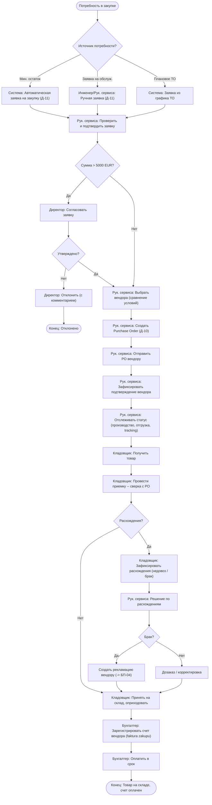
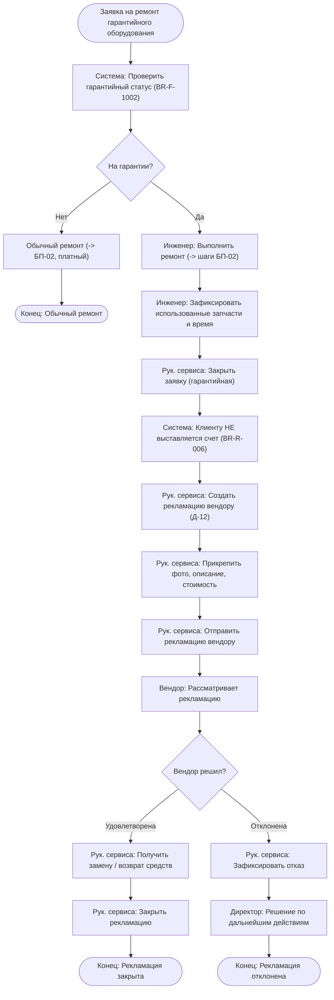
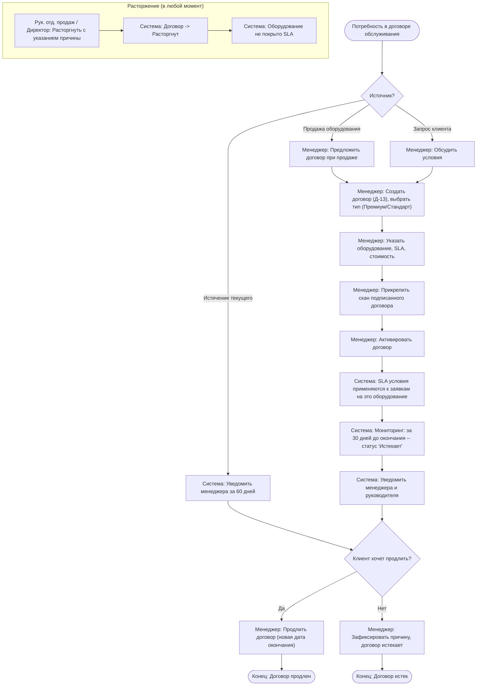
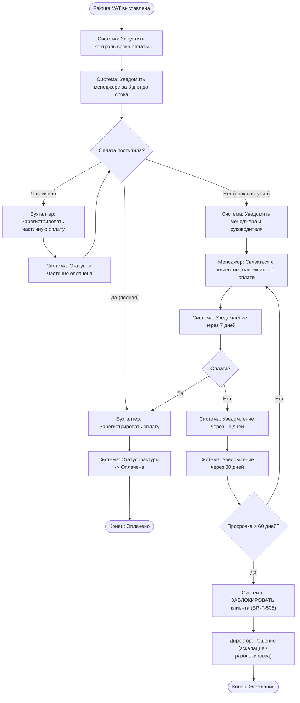
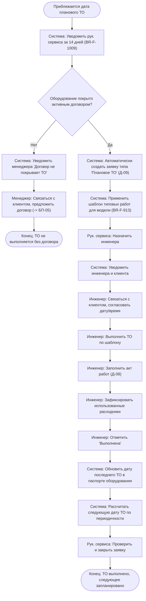

```mermaid
flowchart TD
  Start(["Инициация заявки"]) --> Channel{"Кто инициирует?"}

  %% === КЛИЕНТ ===
  Channel -->|"Клиент"| ClientChannel{"Канал обращения?"}

  ClientChannel -->|"Телефон"| Phone["Менеджер: Принять звонок,\nсоздать заявку вручную\n(channel=phone, operator_id)"]
  ClientChannel -->|"Мессенджер"| Messenger["Система: Создать заявку из сообщения\n(channel=messenger, platform, conversation_id)\nили Менеджер: создать вручную"]
  ClientChannel -->|"Форма на сайте"| WebClient["Клиент: Заполнить форму\nСистема: Создать заявку\n(channel=web_form, session_id)"]
  ClientChannel -->|"Мобильное приложение"| MobileClient["Клиент: Создать заявку в приложении\nСистема: Сохранить\n(channel=mobile_app, device_os, app_version)"]

  %% === ИНЖЕНЕР ===
  Channel -->|"Инженер"| EngineerChannel{"Канал создания?"}

  EngineerChannel -->|"Форма на сайте"| WebEngineer["Инженер: Заполнить форму\nСистема: Создать заявку\n(initiator=engineer, channel=web_form,\nrelated_ticket_id)"]
  EngineerChannel -->|"Мобильное приложение"| MobileEngineer["Инженер: Создать заявку на объекте\nСистема: Сохранить\n(initiator=engineer, channel=mobile_app,\ngeolocation)"]

  %% === ОБЪЕДИНЕНИЕ В ЕДИНЫЙ ПОТОК ===
  Phone --> Register["Система: Заявка зарегистрирована (Д-09)\ninitiator_type + channel сохранены"]
  Messenger --> Register
  WebClient --> Register
  MobileClient --> Register
  WebEngineer --> Register
  MobileEngineer --> Register

  Register --> ValidateData{"Все обязательные\nполя заполнены?"}
  ValidateData -->|"Нет"| ReturnForm["Система: Вернуть форму\nс указанием ошибок"]
  ReturnForm --> Channel
  ValidateData -->|"Да"| SLA["Система: Определить договор и SLA клиента\n(BR-F-1301, BR-F-903)"]

  SLA --> Priority["Система: Рассчитать приоритет и дедлайны\n(BR-F-902)"]
  Priority --> Timer["Система: Запустить таймер SLA реакции"]
  Timer --> Assign["Рук. сервиса: Назначить инженера\n(фильтр: сертификат + загрузка)\n(BR-F-804)"]
  Assign --> Notify["Система: Уведомить инженера\n(push + email, BR-F-914)"]
  Notify --> SLACheck["Система: Зафиксировать SLA реакции\n(соблюден / нарушен)"]
  SLACheck --> WorkStart["Инженер: Начать работу\n(мобильное приложение, BR-F-905)"]

  WorkStart --> Diag["Инженер: Диагностика на объекте"]
  Diag --> NeedParts{"Нужны запчасти?"}

  NeedParts -->|"Да"| PartsCheck{"Запчасти\nна складе инженера?"}
  PartsCheck -->|"Да"| UseParts["Инженер: Использовать запчасть,\nзафиксировать расход"]
  PartsCheck -->|"Нет"| WaitParts["Инженер: Перевести заявку\nв 'Ожидание запчасти'"]
  WaitParts --> Reserve["Рук. сервиса:\nЗарезервировать/заказать (→ БП-03)"]
  Reserve --> Issue["Кладовщик: Выдать запчасть инженеру"]
  Issue --> Continue["Инженер: Продолжить работу"]
  Continue --> UseParts

  NeedParts -->|"Нет"| Repair["Инженер: Выполнить ремонт"]
  UseParts --> Repair

  Repair --> FillAct["Инженер: Заполнить акт работ\nв мобильном приложении (Д-08)"]
  FillAct --> Photo["Инженер: Прикрепить фото до/после"]
  Photo --> Done["Инженер: Отметить 'Работа выполнена'"]
  Done --> History["Система: Записать в историю\nремонтов оборудования (BR-F-906)"]
  History --> WriteOff["Система: Списать запчасти со склада"]
  WriteOff --> Review["Рук. сервиса: Проверить акт работ"]

  Review --> ActOK{"Акт корректен?"}
  ActOK -->|"Нет"| Return["Рук. сервиса: Вернуть на доработку"]
  Return --> FillAct
  ActOK -->|"Да"| Close["Рук. сервиса: Закрыть заявку"]

  Close --> Warranty{"Гарантийный ремонт?"}
  Warranty -->|"Да"| Vendor["Расходы на вендора (→ БП-04)"]
  Vendor --> End1(["Конец: Заявка закрыта"])
  Warranty -->|"Нет"| Invoice["Бухгалтер: Выставить Faktura VAT (Д-04)"]
  Invoice --> Payment["Контроль оплаты (→ БП-06)"]
  Payment --> End1
```

# Приложение Г: Бизнес-процессы ServiceDesk CRM

**Версия:** 1.0 | **Дата:** 21.03.2026

---

## Перечень бизнес-процессов

| ID | Бизнес-процесс | Владелец процесса | Бизнес-цель | Модули системы |
|---|---|---|---|---|
| БП-01 | Продажа оборудования и запчастей | Руководитель отдела продаж | BG-003, BG-004 | CRM, Прайсы, Продажи, Счета, Оплата, Документы |
| БП-02 | Обслуживание оборудования | Руководитель сервиса | BG-001 | Заявки, Оборудование, Склад, Документы, Счета, Оплата |
| БП-03 | Закупка запчастей и оборудования | Руководитель сервиса / Директор | BG-005, BG-007 | Склад, Закупки, Вендоры |
| БП-04 | Гарантийный ремонт и рекламация | Руководитель сервиса | BG-001 | Заявки, Оборудование, Вендоры |
| БП-05 | Управление договорами обслуживания | Руководитель отдела продаж | BG-001, BG-003 | Договоры, CRM, Оборудование |
| БП-06 | Контроль дебиторской задолженности | Бухгалтер / Директор | BG-003 | Счета, Оплата, CRM |
| БП-07 | Плановое техническое обслуживание | Руководитель сервиса | BG-001, BG-002 | Договоры, Оборудование, Заявки |

---

## БП-01: Продажа оборудования и запчастей

### Паспорт процесса

| Параметр | Значение |
|---|---|
| **ID** | БП-01 |
| **Название** | Продажа оборудования, запчастей, расходников и услуг |
| **Владелец** | Руководитель отдела продаж |
| **Участники** | Менеджер по продажам, Руководитель отдела продаж, Директор, Кладовщик, Бухгалтер, Клиент |
| **Триггер** | Обращение клиента / инициатива менеджера / повторная продажа |
| **Вход** | Потребность клиента в оборудовании, запчастях или услугах |
| **Выход** | Оборудование передано клиенту, оплата получена, паспорт оборудования создан |
| **KPI (AS-IS)** | Среднее время подготовки КП: ~4 часа; конверсия воронки: не измеряется |
| **KPI (TO-BE)** | Время подготовки КП: <= 30 мин (BG-004); % просроченных счетов <= 5% (BG-003) |
| **Связанные БТ** | BR-F-100--109, BR-F-200--215, BR-F-300--308, BR-F-400--409, BR-F-500--508, BR-F-600--606 |
| **Документы** | КП (Д-01), Заказ на продажу (Д-02), Faktura VAT (Д-04), WZ (Д-06), Акт приема-передачи (Д-07) |

### AS-IS (текущее состояние)

Менеджер получает запрос от клиента по телефону или email. Ищет цены в Excel-файле прайс-листа. Вручную формирует КП в Word, вставляя реквизиты клиента из записной книжки. Отправляет КП по email. При согласии клиента вручную составляет договор. Бухгалтер формирует фактуру в отдельной программе. Кладовщик отгружает товар по устной просьбе. Контроль оплаты -- через банковскую выписку вручную. Нет единой истории сделки.

**Проблемы AS-IS:** долгая подготовка КП (поиск цен, ручное заполнение); нет воронки продаж; потери из-за неконтролируемых скидок; нет связи между КП, заказом, счетом и отгрузкой; нет контроля дебиторки.

### TO-BE (целевое состояние) -- BPMN-диаграмма

```mermaid
flowchart TD
  Start(["Клиент обращается / Менеджер инициирует"]) --> A["Менеджер: Создать/найти карточку клиента в CRM"]
  A --> B["Менеджер: Создать сделку в воронке (статус: Лид)"]
  B --> C["Менеджер: Квалифицировать потребность клиента"]
  C --> D["Менеджер: Сформировать КП из прайс-листа (Д-01)"]
  D --> E{"Скидка > 15%?"}
  E -->|"Да"| F["Рук. отд. продаж: Согласовать скидку"]
  F --> G{"Согласовано?"}
  G -->|"Нет"| D
  G -->|"Да"| H["Менеджер: Отправить КП клиенту"]
  E -->|"Нет"| H
  H --> I["Менеджер: Перевести сделку в статус 'КП отправлено'"]
  I --> J{"Клиент принял КП?"}
  J -->|"Нет"| K["Менеджер: Зафиксировать причину отказа, закрыть сделку"]
  K --> End1(["Конец: Сделка проиграна"])
  J -->|"Да"| L["Менеджер: Создать Заказ на продажу (Д-02) из КП"]
  L --> M{"Скидка на заказ > 25%?"}
  M -->|"Да"| N["Директор: Согласовать скидку"]
  N --> O{"Утверждено?"}
  O -->|"Нет"| L
  O -->|"Да"| P["Менеджер: Указать серийные номера оборудования"]
  M -->|"Нет"| P
  P --> Q["Менеджер: Подписать заказ с клиентом"]
  Q --> R["Бухгалтер: Выставить Faktura VAT (Д-04)"]
  R --> S["Менеджер: Отправить фактуру клиенту по email"]
  S --> T["Кладовщик: Сформировать WZ (Д-06), проверить наличие на складе"]
  T --> U{"Всё есть на складе?"}
  U -->|"Нет"| V["Рук. сервиса: Создать заявку на закупку (-> БП-03)"]
  V --> W["Ожидание поставки"]
  W --> T
  U -->|"Да"| X["Кладовщик: Отгрузить товар, подтвердить WZ"]
  X --> Y["Менеджер/Инженер: Оформить Акт приема-передачи (Д-07)"]
  Y --> Z["Система: Создать паспорт оборудования (автоматически)"]
  Z --> AA["Система: Контроль оплаты (-> БП-06)"]
  AA --> AB{"Оплата получена?"}
  AB -->|"Да"| AC["Менеджер: Закрыть сделку (Выиграна)"]
  AC --> End2(["Конец: Сделка завершена"])
  AB -->|"Нет"| AD["Эскалация просрочки (-> БП-06)"]
  AD --> AB
```

### Детальные шаги процесса

| # | Шаг | Роль | Действие в системе | Документ | Бизнес-правила |
|---|---|---|---|---|---|
| 1 | Регистрация клиента | Менеджер | Создать / найти карточку клиента | -- | BR-F-200: обязательные реквизиты |
| 2 | Создание сделки | Менеджер | Создать сделку, статус "Лид" | -- | BR-F-202: воронка продаж |
| 3 | Квалификация | Менеджер | Зафиксировать потребность, контактное лицо | -- | BR-F-201: история взаимодействий |
| 4 | Формирование КП | Менеджер | Выбрать позиции из прайс-листа, указать скидки | Д-01 (КП) | BR-F-203: автозаполнение; BR-F-107: индивид. скидки |
| 5 | Согласование скидки | Рук. отд. продаж | Согласовать или отклонить КП | Д-01 | BR-R-002: скидка > 15% |
| 6 | Отправка КП | Менеджер | Экспорт в PDF, отправка по email | Д-01 | BR-F-203: экспорт PDF |
| 7 | Обработка ответа | Менеджер | Изменить статус сделки: принято / отклонено | -- | BR-F-202: этапы воронки |
| 8 | Создание заказа | Менеджер | Создать Заказ из КП, указать серийные номера | Д-02 | BR-F-300--307; BR-R-008: уникальность S/N |
| 9 | Согласование (>25%) | Директор | Согласовать заказ с крупной скидкой | Д-02 | BR-R-003: скидка > 25% |
| 10 | Выставление фактуры | Бухгалтер | Создать Faktura VAT из заказа | Д-04 | BR-F-401--404; BR-R-001: только Менеджер/Бухгалтер |
| 11 | Отправка фактуры | Менеджер | Отправить по email из системы | Д-04 | BR-F-405 |
| 12 | Формирование WZ | Кладовщик | Создать накладную, проверить остатки | Д-06 | BR-F-600, BR-F-706: резерв |
| 13 | Отгрузка | Кладовщик | Подтвердить отгрузку, списать со склада | Д-06 | BR-F-702: привязка к заказу |
| 14 | Приема-передача | Менеджер/Инженер | Подписать акт с клиентом | Д-07 | BR-F-601; автосоздание паспорта BR-F-307 |
| 15 | Контроль оплаты | Бухгалтер | Зарегистрировать оплату, контроль сроков | -- | BR-F-500--508; -> БП-06 |
| 16 | Закрытие сделки | Менеджер | Статус "Закрыто-выиграно" | -- | BR-F-202 |

### Исключения и альтернативные потоки

| ID | Условие | Действие |
|---|---|---|
| АП-01.1 | Клиент просит повторную продажу расходников | Менеджер создает заказ на основе предыдущего (BR-F-308), минуя этап КП |
| АП-01.2 | Частичная отгрузка (не все позиции на складе) | Создается несколько WZ, система отслеживает % отгрузки (BR-F-306) |
| АП-01.3 | Клиент заблокирован по просрочке | Система не позволяет создать заказ (BR-F-505); требуется разблокировка директором |
| АП-01.4 | Клиент запросил корректировку фактуры | Бухгалтер создает Faktura Korygujaca (Д-05) со ссылкой на исходную |

---

## БП-02: Обслуживание оборудования

> **Версия процесса:** 2.0 | **Дата изменения:** 23.03.2026 | **Изменения:** мультиканальная инициация заявки (клиент + инженер), хранение данных об инициаторе и канале

### Паспорт процесса

| Параметр | Значение |
|---|---|
| **ID** | БП-02 |
| **Название** | Внеплановый ремонт / обслуживание оборудования клиента |
| **Владелец** | Руководитель сервиса |
| **Участники** | Клиент, Менеджер, Руководитель сервиса, Сервисный инженер, Кладовщик, Бухгалтер |
| **Триггер** | Обращение клиента (телефон, мессенджер, форма на сайте, мобильное приложение) **или** инициатива инженера (форма на сайте, мобильное приложение) |
| **Вход** | Заявка на ремонт, поступившая по одному из каналов |
| **Выход** | Оборудование отремонтировано, акт подписан, счет оплачен |
| **KPI (AS-IS)** | Время назначения инженера: ~8 часов; нет контроля SLA |
| **KPI (TO-BE)** | Время назначения: <= 2 часа (BG-001); SLA соблюдение >= 95% |
| **Связанные БТ** | BR-F-900--920, BR-F-1000--1010, BR-F-700--712, BR-F-602, BR-F-400--409 |
| **Документы** | Заявка (Д-09), Акт работ (Д-08), Faktura VAT (Д-04) |

### Каналы инициации заявки

#### Инициатор: Клиент

| Канал | Описание | Как создаётся заявка | Данные, которые фиксируются |
|---|---|---|---|
| **Телефон** | Клиент звонит на линию поддержки | Менеджер / Рук. сервиса создаёт заявку вручную в системе со слов клиента | initiator_type = `client`, channel = `phone`, operator_id (кто принял звонок) |
| **Мессенджер** | Клиент пишет в чат (WhatsApp, Telegram и др.) | Система создаёт заявку автоматически из сообщения **или** менеджер создаёт вручную | initiator_type = `client`, channel = `messenger`, messenger_platform, conversation_id |
| **Форма на сайте** | Клиент заполняет веб-форму на портале самообслуживания | Система создаёт заявку автоматически при отправке формы | initiator_type = `client`, channel = `web_form`, session_id |
| **Мобильное приложение** | Клиент создаёт заявку в мобильном приложении | Система создаёт заявку автоматически | initiator_type = `client`, channel = `mobile_app`, device_os, app_version |

#### Инициатор: Сервисный инженер

| Канал | Описание | Как создаётся заявка | Данные, которые фиксируются |
|---|---|---|---|
| **Форма на сайте** | Инженер обнаружил проблему (например, при плановом ТО) и регистрирует заявку через портал | Инженер заполняет форму, указывая оборудование и описание проблемы | initiator_type = `engineer`, channel = `web_form`, engineer_id, related_ticket_id (если связано с другой заявкой) |
| **Мобильное приложение** | Инженер на объекте создаёт заявку «на месте» | Инженер заполняет форму в приложении, может приложить фото | initiator_type = `engineer`, channel = `mobile_app`, engineer_id, device_os, geolocation |

### Бизнес-правила (новые и изменённые)

| ID | Правило | Описание |
|---|---|---|
| BR-F-916 | Обязательность канала | При создании заявки поля `initiator_type`, `initiator_id` и `channel` заполняются обязательно. Система не позволяет сохранить заявку без этих данных |
| BR-F-917 | Авто-определение инициатора | Если заявку создаёт клиент через сайт или приложение — `initiator_type` = `client`, `initiator_id` = ID клиента из сессии. Если инженер — `initiator_type` = `engineer`, `initiator_id` = ID инженера |
| BR-F-918 | Оператор при телефонном обращении | Если channel = `phone`, поле `operator_id` обязательно. Система автоматически подставляет ID текущего пользователя (менеджера/оператора) |
| BR-F-919 | Геолокация инженера | Если initiator_type = `engineer` и channel = `mobile_app`, система запрашивает геолокацию и сохраняет в `geolocation` (с согласия пользователя) |
| BR-F-920 | Привязка к родительской заявке | Если инженер создаёт заявку из контекста другой заявки (например, обнаружил доп. проблему при ТО), `related_ticket_id` заполняется автоматически |

### AS-IS

Клиент звонит или пишет email. Менеджер записывает в Excel. Руководитель сервиса вручную назначает инженера по телефону. Инженер едет на объект, ремонтирует, заполняет бумажный акт. Акт передается в офис с задержкой 1-3 дня. Бухгалтер выставляет счет вручную. Нет контроля SLA. Нет истории ремонтов. Расход запчастей не привязан к заявке. Инициатор и канал обращения не фиксируются — невозможно анализировать нагрузку по каналам и качество обработки.

**Проблемы:** долгое назначение; потеря заявок; нет SLA; бумажные акты теряются; запчасти списываются "в никуда"; нет истории оборудования; невозможно определить, кто и как инициировал заявку.

### TO-BE -- BPMN-диаграмма

### Детальные шаги

| # | Шаг | Роль | Действие | Документ | SLA/Правила |
|---|---|---|---|---|---|
| 1 | Инициация заявки | Клиент / Инженер | Клиент обращается по одному из каналов (телефон, мессенджер, форма на сайте, мобильное приложение) **или** инженер создаёт заявку через сайт / мобильное приложение | -- | BR-F-916: initiator_type + channel обязательны |
| 2 | Регистрация заявки | Менеджер / Система | **Телефон:** менеджер создаёт заявку вручную (operator_id). **Мессенджер:** система создаёт автоматически или менеджер вручную. **Сайт / Приложение:** система создаёт автоматически при отправке формы | Д-09 (Новая) | BR-F-900; BR-F-917; BR-F-918; описание >= 10 символов |
| 3 | Валидация данных | Система | Проверить обязательные поля: клиент, оборудование (S/N), тип, описание, initiator_type, channel | -- | BR-F-916 |
| 4 | Определение SLA | Система | Найти договор клиента, подтянуть параметры SLA | -- | BR-F-1301; BR-F-903 |
| 5 | Расчёт приоритета | Система | Приоритет = f(тип договора, тип оборудования) | -- | BR-F-902 |
| 6 | Назначение инженера | Рук. сервиса | Выбрать из списка (фильтр: сертификат + загрузка) | Д-09 (Назначена) | BR-F-804; BR-F-802 |
| 7 | Уведомление | Система | Push + email инженеру в течение 1 мин | -- | BR-F-914; BR-F-1402 |
| 8 | Контроль SLA реакции | Система | assigned_at <= response_deadline? | -- | BR-F-903; эскалация BR-F-904 |
| 9 | Начало работы | Инженер | Нажать «Начать работу» в мобильном приложении | Д-09 (В работе) | BR-F-905 |
| 10 | Диагностика | Инженер | Осмотр оборудования на объекте | -- | -- |
| 11 | Запрос запчастей | Инженер | Перевести в «Ожидание» с указанием запчасти | Д-09 (Ожидание) | BR-F-706: резервирование |
| 12 | Выдача запчастей | Кладовщик | Списать со склада, выдать инженеру | -- | BR-F-702; BR-R-005 |
| 13 | Выполнение ремонта | Инженер | Устранить неисправность | -- | -- |
| 14 | Заполнение акта | Инженер | Описание работ, запчасти, фото, время | Д-08 (Черновик) | BR-F-905: мин. 1 фото |
| 15 | Завершение | Инженер | Нажать «Работа выполнена» | Д-09 (Выполнена) | время > 0, описание >= 20 символов |
| 16 | Автозапись | Система | Добавить в историю ремонтов оборудования | -- | BR-F-906; BR-F-1001 |
| 17 | Проверка акта | Рук. сервиса | Проверить корректность, принять или вернуть | Д-09 (На проверке) | BR-R-004: акт обязателен |
| 18 | Закрытие заявки | Рук. сервиса | «Принять и закрыть» | Д-09 (Закрыта) | BR-F-903: фиксация SLA решения |
| 19 | Выставление счёта | Бухгалтер | Faktura VAT (если не гарантия) | Д-04 | BR-R-006: гарантия = на вендора |

### Исключения

| ID | Условие | Действие |
|---|---|---|
| АП-02.1 | SLA реакции нарушается (за 1 час до дедлайна) | Автоэскалация руководителю (BR-F-904) |
| АП-02.2 | Инженер не сертифицирован на модель | Система не позволяет назначить (BR-F-804) |
| АП-02.3 | Инженер в отпуске | Система показывает предупреждение (BR-F-808) |
| АП-02.4 | Запчасти нет на складе | → БП-03 (закупка); заявка в «Ожидание» |
| АП-02.5 | Гарантийный ремонт | Клиенту не выставляется счёт; → БП-04 (рекламация) |
| АП-02.6 | Клиент обращается в мессенджер, но не идентифицирован в системе | Менеджер запрашивает данные клиента, создаёт/привязывает карточку, затем регистрирует заявку |
| АП-02.7 | Инженер создаёт заявку по оборудованию без активного договора | Система предупреждает об отсутствии договора; заявка создаётся со статусом «Без SLA»; менеджеру уведомление предложить договор (→ БП-05) |
| АП-02.8 | Дублирование заявки (клиент обратился по нескольким каналам) | Система проверяет наличие открытых заявок по тому же оборудованию за последние 24 часа и предупреждает оператора о возможном дубле |

---

## БП-03: Закупка запчастей и оборудования

### Паспорт процесса

| Параметр | Значение |
|---|---|
| **ID** | БП-03 |
| **Название** | Полный цикл закупки: от потребности до приемки на склад |
| **Владелец** | Руководитель сервиса / Директор |
| **Участники** | Рук. сервиса, Директор, Кладовщик, Бухгалтер |
| **Триггер** | Минимальный остаток на складе / заявка на обслуживание / плановое ТО |
| **Вход** | Потребность в запчастях или оборудовании |
| **Выход** | Товар принят на склад, счет вендору оплачен |
| **KPI (AS-IS)** | Средний цикл закупки: ~30 дней |
| **KPI (TO-BE)** | Средний цикл: <= 14 дней (BG-007); расхождения при приемке <= 2% |
| **Связанные БТ** | BR-F-700--712, BR-F-1100--1111, BR-F-1200--1208 |
| **Документы** | Заявка на закупку (Д-11), Purchase Order (Д-10) |

### TO-BE -- BPMN-диаграмма

### Детальные шаги

| # | Шаг | Роль | Документ | Правила |
|---|---|---|---|---|
| 1 | Формирование потребности | Система / Инженер | Д-11 (Черновик) | BR-F-1200: три источника потребности |
| 2 | Подтверждение заявки | Рук. сервиса | Д-11 (Согл. рук.) | BR-F-1201 |
| 3 | Согласование (>5000 EUR) | Директор | Д-11 (Согл. дир.) | BR-R-007 |
| 4 | Выбор вендора | Рук. сервиса | -- | BR-F-1203: сравнение цен/сроков/качества |
| 5 | Создание PO | Рук. сервиса | Д-10 (Черновик) | BR-F-1101, BR-F-1204 |
| 6 | Отправка вендору | Рук. сервиса | Д-10 (Отправлен) | BR-F-1102 |
| 7 | Отслеживание | Рук. сервиса | Д-10 (Подтвержден -> Отгружен) | BR-F-1105: tracking |
| 8 | Приемка | Кладовщик | Д-10 (Доставлен -> Принят) | BR-F-1106: сверка |
| 9 | Оприходование | Кладовщик | -- | BR-F-701: приход на склад |
| 10 | Регистрация счета | Бухгалтер | -- | BR-F-1103 |
| 11 | Оплата вендору | Бухгалтер | -- | BR-F-1104: контроль сроков |

### Исключения

| ID | Условие | Действие |
|---|---|---|
| АП-03.1 | Директор отклонил заявку | Возврат инициатору с комментарием |
| АП-03.2 | Вендор не подтверждает PO | Рук. сервиса выбирает альтернативного вендора |
| АП-03.3 | Обнаружен брак при приемке | Создается рекламация вендору (-> БП-04) |
| АП-03.4 | Срочная закупка под заявку | Ускоренное согласование, пометка "Срочно" |

---

## БП-04: Гарантийный ремонт и рекламация вендору

### Паспорт процесса

| Параметр | Значение |
|---|---|
| **ID** | БП-04 |
| **Название** | Гарантийный ремонт оборудования и рекламация вендору |
| **Владелец** | Руководитель сервиса |
| **Участники** | Клиент, Рук. сервиса, Инженер, Вендор (Matica) |
| **Триггер** | Заявка на ремонт оборудования, находящегося на гарантии / обнаружение брака при приемке |
| **Вход** | Неисправность гарантийного оборудования или бракованная поставка |
| **Выход** | Оборудование отремонтировано, вендор возместил расходы (замена / возврат средств) |
| **Связанные БТ** | BR-F-900--915, BR-F-1002, BR-F-1111, BR-R-006 |
| **Документы** | Заявка (Д-09), Акт работ (Д-08), Рекламация (Д-12) |

### TO-BE -- BPMN-диаграмма

### Детальные шаги

| # | Шаг | Роль | Документ | Правила |
|---|---|---|---|---|
| 1 | Проверка гарантии | Система | -- | BR-F-1002: warranty_end >= текущая дата |
| 2 | Ремонт | Инженер | Д-09, Д-08 | Все шаги БП-02 |
| 3 | Не тарифицировать | Система | -- | BR-R-006: расходы на вендора |
| 4 | Создать рекламацию | Рук. сервиса | Д-12 (Создана) | BR-F-1111: тип, фото, описание >= 20 симв. |
| 5 | Отправить вендору | Рук. сервиса | Д-12 (Отправлена) | Мин. 1 фото |
| 6 | Ожидание решения | Рук. сервиса | Д-12 (На рассмотрении) | -- |
| 7 | Получить результат | Рук. сервиса | Д-12 (Удовлетворена / Отклонена) | Указать S/N замены или сумму возврата |
| 8 | Закрыть | Рук. сервиса | Д-12 (Закрыта) | -- |

---

## БП-05: Управление договорами обслуживания

### Паспорт процесса

| Параметр | Значение |
|---|---|
| **ID** | БП-05 |
| **Название** | Жизненный цикл договора обслуживания |
| **Владелец** | Руководитель отдела продаж |
| **Участники** | Менеджер, Рук. отд. продаж, Рук. сервиса, Клиент |
| **Триггер** | Продажа оборудования / запрос клиента на обслуживание / истечение договора |
| **Вход** | Потребность клиента в договоре обслуживания |
| **Выход** | Активный договор с определёнными условиями SLA и перечнем оборудования |
| **Связанные БТ** | BR-F-1300--1305 |
| **Документы** | Договор обслуживания (Д-13) |

### TO-BE -- BPMN-диаграмма

### Детальные шаги

| # | Шаг | Роль | Документ | Правила |
|---|---|---|---|---|
| 1 | Инициация | Менеджер | Д-13 (Черновик) | BR-F-1300 |
| 2 | Выбор типа | Менеджер | Д-13 | Премиум (SLA 2/24) / Стандарт (SLA 8/72) |
| 3 | Привязка оборудования | Менеджер | Д-13 | Мин. 1 единица (BR-F-1300) |
| 4 | Подписание | Клиент | Д-13 | Скан обязателен |
| 5 | Активация | Менеджер | Д-13 (Активен) | BR-F-1301: SLA применяется автоматически |
| 6 | Мониторинг | Система | -- | BR-F-1302: уведомления за 60 и 30 дней |
| 7 | Продление | Менеджер | Д-13 (Активен, новая дата) | Новая дата > текущей |
| 8 | Расторжение | Рук. / Директор | Д-13 (Расторгнут) | Причина обязательна |

---

## БП-06: Контроль дебиторской задолженности

### Паспорт процесса

| Параметр | Значение |
|---|---|
| **ID** | БП-06 |
| **Название** | Контроль оплаты и управление дебиторской задолженностью |
| **Владелец** | Бухгалтер / Директор |
| **Участники** | Бухгалтер, Менеджер, Руководитель отдела продаж, Директор |
| **Триггер** | Выставление счета клиенту (из БП-01 или БП-02) |
| **Вход** | Выставленная Faktura VAT с суммой и сроком оплаты |
| **Выход** | Оплата получена или задолженность эскалирована |
| **KPI (AS-IS)** | Просроченные счета: ~20% |
| **KPI (TO-BE)** | Просроченные: <= 5% (BG-003) |
| **Связанные БТ** | BR-F-500--508 |

### TO-BE -- BPMN-диаграмма

### Детальные шаги

| # | Шаг | Роль | Правила |
|---|---|---|---|
| 1 | Запуск контроля | Система | BR-F-500: отслеживание с момента выставления |
| 2 | Напоминание (за 3 дня) | Система -> Менеджер | BR-F-503 |
| 3 | Регистрация оплаты | Бухгалтер | BR-F-501: привязка к счету |
| 4 | Уведомление (в день срока) | Система -> Менеджер + Руководитель | BR-F-503 |
| 5 | Контакт с клиентом | Менеджер | BR-F-201: запись в историю |
| 6 | Уведомления (7, 14, 30 дней) | Система | BR-F-503 |
| 7 | Блокировка (> 60 дней) | Система | BR-F-505: блокировка заказов и счетов |
| 8 | Реестр дебиторки | Бухгалтер / Директор | BR-F-504: группировка по срокам |
| 9 | Акт сверки | Бухгалтер | BR-F-506: по запросу |

---

## БП-07: Плановое техническое обслуживание

### Паспорт процесса

| Параметр | Значение |
|---|---|
| **ID** | БП-07 |
| **Название** | Плановое ТО оборудования по графику |
| **Владелец** | Руководитель сервиса |
| **Участники** | Рук. сервиса, Инженер, Клиент |
| **Триггер** | Наступление даты планового ТО по графику |
| **Вход** | График ТО для оборудования, покрытого договором |
| **Выход** | ТО выполнено, запись в истории оборудования |
| **Связанные БТ** | BR-F-909, BR-F-1009, BR-F-1300--1305 |
| **Документы** | Заявка (Д-09), Акт работ (Д-08) |

### TO-BE -- BPMN-диаграмма

### Детальные шаги

| # | Шаг | Роль | Правила |
|---|---|---|---|
| 1 | Уведомление о ТО | Система | BR-F-1009: за 14 дней |
| 2 | Проверка договора | Система | BR-F-1304: блокировка без договора |
| 3 | Создание заявки | Система | BR-F-909: автоматически по графику |
| 4 | Применение шаблона | Система | BR-F-913: перечень работ и запчастей |
| 5 | Назначение | Рук. сервиса | BR-F-804: фильтр по компетенциям |
| 6 | Согласование с клиентом | Инженер | BR-F-910: уведомление клиенту |
| 7 | Выполнение ТО | Инженер | По шаблону типовых работ |
| 8 | Акт работ | Инженер | Д-08; BR-F-905 |
| 9 | Обновление паспорта | Система | BR-F-1001: запись в историю; обновить last_maintenance_date |
| 10 | Планирование следующего | Система | По периодичности из паспорта оборудования |
| 11 | Закрытие | Рук. сервиса | BR-R-004 |

### Исключения

| ID | Условие | Действие |
|---|---|---|
| АП-07.1 | Оборудование не покрыто договором | ТО не создается; менеджеру уведомление предложить договор |
| АП-07.2 | Клиент просит перенести дату | Инженер переносит, система корректирует дедлайн |
| АП-07.3 | При ТО обнаружена неисправность | Инженер создает дополнительную заявку типа "Внеплановый ремонт" |

---

## Gap-анализ (сводный по всем процессам)

| # | Область | AS-IS | TO-BE | Разрыв | Процесс |
|---|---|---|---|---|---|
| 1 | Приём заявок | Email, телефон, Excel | Единая точка входа, авторегистрация, SLA | Нет системы | БП-02 |
| 2 | Подготовка КП | Excel + Word, ~4 часа | Из прайс-листа в 1 клик, <= 30 мин | Ручная работа | БП-01 |
| 3 | Контроль SLA | Отсутствует | Автоматический мониторинг + эскалации | Нет контроля | БП-02 |
| 4 | Воронка продаж | Не ведется | Этапы, конверсия, прогноз | Нет данных | БП-01 |
| 5 | Контроль оплаты | Ручной через банк | Автоуведомления, реестр дебиторки, блокировка | Потери 20% | БП-06 |
| 6 | Учет запчастей | Тетрадь / Excel | Складской учет, FIFO, мин. остатки | Расхождения | БП-03 |
| 7 | История оборудования | Нет | Паспорт устройства, полная история ремонтов | Нет данных | БП-02, БП-07 |
| 8 | Закупки | Email с вендором | Полный цикл с согласованием и tracking | ~30 дней | БП-03 |
| 9 | Гарантийные ремонты | Нет учета | Рекламации вендору, контроль возмещения | Потери | БП-04 |
| 10 | Договоры | Папка с файлами | Учет, мониторинг, уведомления о продлении | Пропуски | БП-05 |
